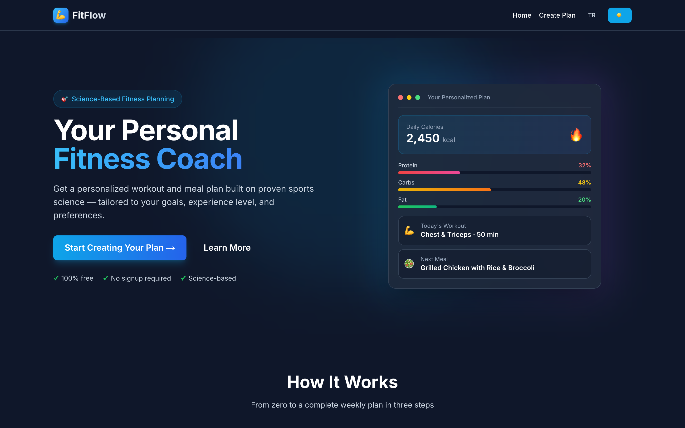
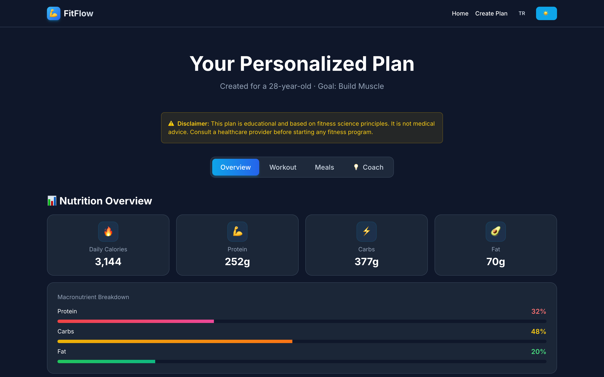
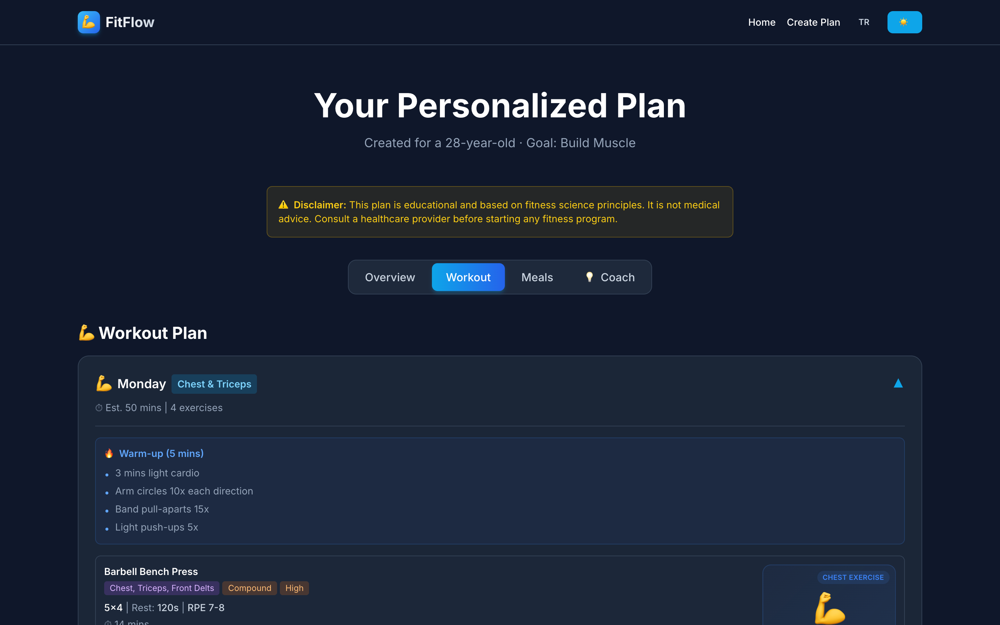
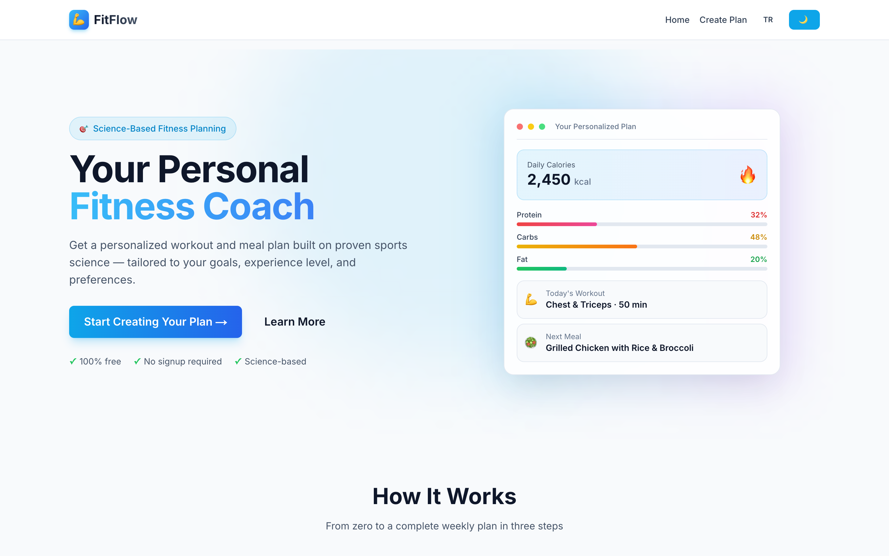
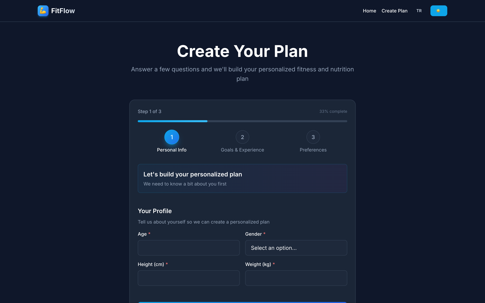
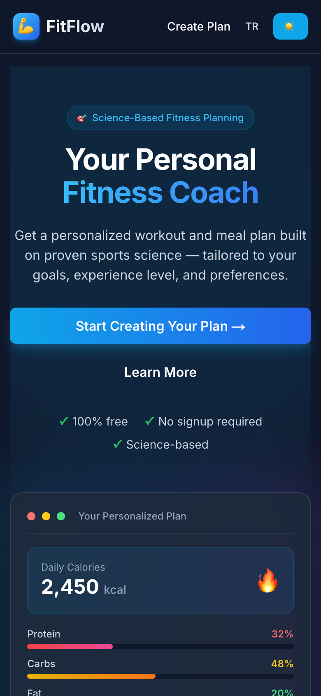

# FitFlow — Personalized Fitness & Nutrition Planner

**Generate a complete, science-based 7-day workout and meal plan in seconds — free, bilingual (EN/TR), no signup required.**

[](https://github.com/mehmetkeless00/fitai-ai-fitness-planner/actions/workflows/ci.yml)
[](https://fitai-ai-fitness-planner.vercel.app/)
[](https://nextjs.org/)
[](https://tailwindcss.com/)
[](LICENSE)



**[→ Try the live app](https://fitai-ai-fitness-planner.vercel.app/)**

---

## What it does

FitFlow asks for your profile (age, height, weight, goals, experience, training frequency, dietary preference) in a 3-step form, then generates a full week of training and nutrition:

- **Workout plan** — 3–7 day splits with sets, reps, rest times, RPE targets, warm-up/cool-down routines, exercise alternatives, and per-exercise form instructions
- **Nutrition plan** — daily calories and macros calculated from your profile, four meals per day matched to 7 dietary preferences (omnivore → vegan → keto…), with allergy filtering
- **Coach insights** — recovery score, risk flags, daily habit tips, hydration targets, and a weekly grocery list
- **PDF export** — the entire plan as a downloadable PDF, fully localized (including embedded Unicode font support for Turkish characters)
- **Bilingual UI** — complete English and Turkish coverage via a hand-rolled i18n layer, including the generated plan content

## How the plan engine works

The generator is a transparent, rule-based engine built on established sports-science formulas — no black boxes:

```
Profile → BMR (Mifflin-St Jeor) → TDEE (activity factor by training frequency)
       → goal-adjusted calories (surplus/deficit) → macro split by goal
       → workout split by experience level & frequency → meals by diet + allergies
       → recovery score, risk flags, hydration & habit recommendations
```

Every number shown to the user is reproducible from the formulas in [`utils/generateSmartPlan.js`](utils/generateSmartPlan.js).

## Screenshots

| Result dashboard | Workout detail |
|---|---|
|  |  |

| Light mode | Plan wizard | Mobile |
|---|---|---|
|  |  |  |

## Tech stack

- **Next.js 14** (App Router) — static pages + one dynamic API route
- **React 18** with custom context providers for theme (dark/light) and language (EN/TR)
- **Tailwind CSS** — class-strategy dark mode, fully responsive
- **jsPDF** — client-side PDF export with an embedded Open Sans font for Turkish glyph support, lazy-loaded so it never touches the initial bundle
- **No database, no external APIs** — plans live in localStorage; the engine runs entirely on the server route

## Architecture

```
app/
  page.js               # Landing (server component + client sections)
  create-plan/          # 3-step wizard with per-step validation
  result/               # Tabbed dashboard (overview / workout / meals / coach)
  api/generate-plan/    # Validated POST endpoint → plan JSON
components/
  ui/                   # Button, Card, Input, Select, ToggleGroup, loaders
  layout/               # Navigation, providers (Theme, Language), footer
  features/             # Home sections, form steps, result views
utils/
  generateSmartPlan.js  # Rule-based plan engine (BMR → TDEE → macros → plan)
  planStrings.js        # Localized meal databases & coach advice (EN/TR)
  translations.js       # Central UI dictionary (EN/TR)
  pdf-generator.js      # Localized PDF export
```

**Design decision worth noting:** enum-like values (day names, difficulty, intensity, workout focus) are stored as English keys in the plan data and translated only at the display layer — so switching languages re-labels an existing plan without regenerating it.

## Getting started

```bash
git clone https://github.com/mehmetkeless00/fitai-ai-fitness-planner.git
cd fitai-ai-fitness-planner
npm install
npm run dev
```

Open [http://localhost:3000](http://localhost:3000). No environment variables required.

## Testing

```bash
npm test            # run the suite once
npm run test:watch  # watch mode
```

33 unit tests cover the plan engine (BMR/TDEE/macro math, frequency schedules, risk flags, allergy filtering, localization fallbacks) and EN/TR dictionary parity — every key must exist in both languages or the suite fails. CI runs tests + build on every push.

## Roadmap

- [x] Bilingual UI + localized plan generation (EN/TR)
- [x] Localized PDF export with Unicode font embedding
- [x] Honest, science-based product messaging
- [x] Unit tests for the calculation engine + CI
- [ ] Meal variety & swap functionality
- [ ] Saved plan history (local-first, then Supabase)
- [ ] Authentication & cloud sync
- [ ] Progress tracking with adaptive calorie targets
- [ ] AI coach chat (Claude API)
- [ ] Mobile app (Expo / React Native, sharing the plan engine)

## Known limitations

Honest notes on the current state:

- Plans are stored in localStorage only — clearing browser data deletes them (cloud sync is on the roadmap)
- Generated plan content (meal names, advice) stays in the language active at generation time; UI labels translate live
- Meal databases are curated but finite (4 options per meal slot per diet), so weekly repetition is possible
- The "coach" is rule-based — advice is selected from goal-specific guidance written into the engine, not generated by an LLM

## License

[MIT](LICENSE)

## Author

**Mehmet Keleş** — Computer Engineering graduate, full-stack & AI development enthusiast

GitHub: [@mehmetkeless00](https://github.com/mehmetkeless00)
